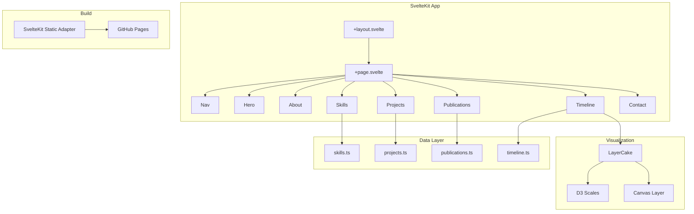
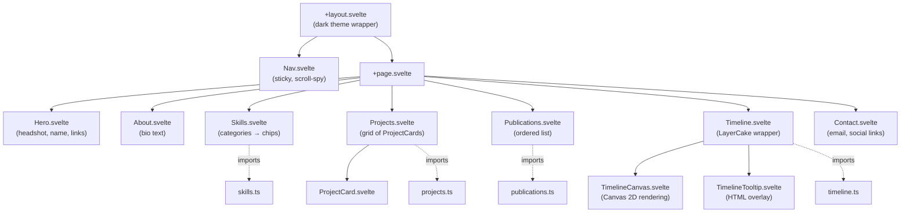
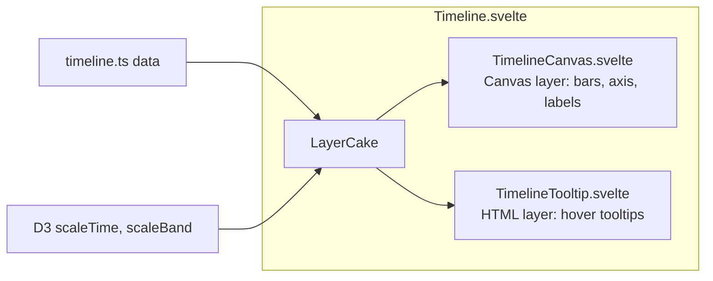

# Design Document: Portfolio Website

## Overview

This design describes a single-page scrollable portfolio website for Harpreet Singh, built with SvelteKit and hosted via GitHub Pages at hrrysprk.com. The site features seven content sections (Hero, About, Skills, Projects, Publications, Timeline, Contact) with a sticky navigation bar, dark theme with viridis accent colors, and an interactive D3/LayerCake/Canvas timeline visualization.

The architecture follows SvelteKit's file-based routing with a single `+page.svelte` entry point that composes section components. All content is driven by static JSON/TypeScript data files, making the site easy to update without touching component code. The interactive timeline uses LayerCake as the Svelte-native visualization framework with D3 for scales/axes and Canvas for performant rendering.

Key design decisions:
- Single `+page.svelte` route (no multi-page routing needed for a single-page portfolio)
- Static data files in `src/lib/data/` rather than a CMS or API
- LayerCake for the timeline (Svelte-native, responsive by default, supports Canvas/SVG/HTML layers)
- CSS custom properties for the viridis color system (easy theming, no runtime overhead)
- SvelteKit static adapter with `fallback: '404.html'` for GitHub Pages compatibility

## Architecture

### High-Level Architecture



### Project Structure

```
src/
├── app.html                    # HTML shell
├── app.css                     # Global styles, CSS custom properties, viridis palette
├── routes/
│   ├── +layout.svelte          # Root layout (Nav, global wrapper, footer)
│   └── +page.svelte            # Single page composing all sections
├── lib/
│   ├── components/
│   │   ├── Nav.svelte          # Sticky navigation bar
│   │   ├── Hero.svelte         # Hero section
│   │   ├── About.svelte        # About section
│   │   ├── Skills.svelte       # Skills section
│   │   ├── Projects.svelte     # Projects grid
│   │   ├── ProjectCard.svelte  # Individual project card
│   │   ├── Publications.svelte # Publications list
│   │   ├── Timeline.svelte     # Timeline wrapper (LayerCake)
│   │   ├── TimelineCanvas.svelte # Canvas rendering layer
│   │   ├── TimelineTooltip.svelte # HTML tooltip layer
│   │   └── Contact.svelte      # Contact section
│   ├── data/
│   │   ├── projects.ts         # Project entries
│   │   ├── publications.ts     # Publication entries
│   │   ├── skills.ts           # Skills by category
│   │   └── timeline.ts         # Timeline entries
│   └── types.ts                # TypeScript interfaces
├── static/
│   ├── images/                 # Headshot, project thumbnails
│   ├── resume.pdf              # Downloadable resume
│   └── CNAME                   # GitHub Pages custom domain
svelte.config.js                # Static adapter config
```

### Component Hierarchy and Data Flow



Data flows one direction: static TypeScript data files → component imports → rendered UI. No stores or global state management needed. The Nav component uses an Intersection Observer to track which section is in view for scroll-spy highlighting.

### SvelteKit Static Adapter Configuration

```javascript
// svelte.config.js
import adapter from '@sveltejs/adapter-static';

export default {
  kit: {
    adapter: adapter({
      pages: 'build',
      assets: 'build',
      fallback: '404.html',
      precompress: false,
      strict: true
    }),
    paths: {
      base: ''
    }
  }
};
```

The `CNAME` file in `static/` ensures GitHub Pages serves the site at `hrrysprk.com`. The base path is empty since we're using a custom domain (not a `/repo-name/` subpath).

## Components and Interfaces

### Nav Component

Sticky navigation bar fixed to the top of the viewport. Uses Intersection Observer API to detect which section is currently in view and highlights the corresponding nav link.

Props: none (section IDs are hardcoded since the page structure is fixed).

Behavior:
- Renders links for: About, Skills, Projects, Publications, Timeline, Contact
- On click: calls `element.scrollIntoView({ behavior: 'smooth' })` for the target section
- On scroll: Intersection Observer updates the active link based on which section occupies the most viewport space
- Below 768px: collapses into a hamburger menu with a slide-out panel
- Uses `position: sticky; top: 0` with a semi-transparent dark background and backdrop blur

### Hero Component

Full-viewport-height introductory section.

Props: none (content is static/hardcoded).

Renders:
- Headshot image (`` with `alt` text, lazy-loaded: no — it's above the fold)
- Name: "Harpreet Singh"
- Tagline: one-liner about computational biology × data science × visualization
- Icon links: GitHub, LinkedIn, Resume PDF — each opens in `target="_blank"` with `rel="noopener noreferrer"`
- Viridis accent on icon hover states

### Skills Component

Displays skills grouped by category using data from `skills.ts`.

Props: none (imports data directly).

Renders:
- One group per category with a category heading
- Each skill as a chip/tag element
- Category headings use distinct viridis colors to differentiate groups
- Responsive: wraps chips within each category, stacks categories vertically on narrow viewports

### Projects Component

Grid of ProjectCard components.

Props: none (imports data directly from `projects.ts`).

Behavior:
- Renders a CSS Grid: 2 columns on desktop (≥1024px), 1 column on mobile (<768px)
- Primary projects (GenBrowser, ChromApipe, spaceGen, PolicyLens) are rendered first with larger card styling (spanning full width or with visual emphasis)
- Remaining projects rendered in standard card size

### ProjectCard Component

Individual project display card.

Props:
- `project: Project` — the project data object

Renders:
- Thumbnail image (lazy-loaded)
- Project title
- One-liner description
- Tech stack as small tags
- Optional live demo link (opens in new tab)
- Hover/focus state: subtle border glow using viridis color, slight elevation via `box-shadow`

### Publications Component

Ordered list of publications.

Props: none (imports data directly from `publications.ts`).

Renders:
- Each publication as a styled list item with: title (bold), full author list with the portfolio owner's name in bold (`<strong>`), journal name (italic), year, and a clickable DOI/URL link
- Reverse chronological order (2021, 2020, 2019)
- Links open in new tab

### Timeline Component (LayerCake Wrapper)

The main interactive visualization. Wraps a LayerCake instance with Canvas and HTML layers.

Props: none (imports data directly from `timeline.ts`).

Architecture:


LayerCake configuration:
- `x` accessor: maps to date range (start/end dates)
- `y` accessor: maps to entry label/category
- `xScale`: `d3.scaleTime()` domain from 2013 to 2026
- `yScale`: `d3.scaleBand()` for entry rows
- `padding`: responsive padding via LayerCake's built-in responsive container

Canvas layer (`TimelineCanvas.svelte`):
- Draws horizontal bars for each timeline entry (start → end date)
- Color-codes bars by entry type (education, research, work) using viridis palette stops
- Draws axis ticks and year labels

HTML tooltip layer (`TimelineTooltip.svelte`):
- Listens for mouse/touch events on the Canvas
- Uses LayerCake's `$width`, `$height`, and scale accessors to map pointer position back to data
- Displays a positioned tooltip with: title, institution, date range, description
- Tooltip is keyboard-accessible via a hidden list of focusable elements that trigger the same tooltip

Accessibility fallback:
- A visually hidden `<ul>` with `role="list"` renders all timeline entries as text for screen readers
- Each `<li>` contains: title, institution, date range, description

Responsive behavior:
- LayerCake automatically resizes the Canvas to its container width
- Below 480px: entries may switch to a vertical stacked layout if horizontal bars become too compressed
- Touch targets for tooltip interaction are at least 44×44px

### Contact Component

Simple section with contact info.

Props: none (content is static).

Renders:
- Email link (`mailto:`)
- GitHub and LinkedIn icon links (same as Hero, for redundancy at page bottom)
- All links open in new tab or trigger mailto

## Data Models

### TypeScript Interfaces

```typescript
// src/lib/types.ts

export interface Project {
  id: string;
  title: string;
  description: string;
  stack: string[];
  thumbnail: string;       // path relative to /static/images/
  liveUrl?: string;        // optional — not all projects have live demos
  repoUrl?: string;        // optional GitHub repo link
  primary: boolean;        // true for the 4 featured projects
}

export interface Publication {
  title: string;
  authors: string;         // full author list, portfolio owner's name wrapped in <strong> tags
  journal: string;
  year: number;
  url: string;             // DOI or direct link
}

export interface SkillCategory {
  name: string;            // e.g. "Languages", "Bioinformatics"
  color: string;           // viridis hex for this category
  skills: string[];        // e.g. ["Python", "R", "TypeScript", "JavaScript"]
}

export interface TimelineEntry {
  id: string;
  title: string;           // e.g. "BS-MS, Biology"
  institution: string;     // e.g. "IISER Pune"
  type: 'education' | 'research' | 'work';
  startDate: string;       // ISO date string, e.g. "2013-08-01"
  endDate: string;         // ISO date string, e.g. "2018-05-01"
  description: string;     // brief description for tooltip
}
```

### Sample Data Structure

```typescript
// src/lib/data/projects.ts
import type { Project } from '$lib/types';

export const projects: Project[] = [
  {
    id: 'genbrowser',
    title: 'GenBrowser',
    description: 'Interactive 3D chromosome visualization with CSAA algorithm',
    stack: ['TypeScript', 'Three.js', 'Vite', 'D3.js', 'lil-gui'],
    thumbnail: 'images/genbrowser.png',
    liveUrl: 'https://hrrysprk.github.io/genBrowser',
    repoUrl: 'https://github.com/hrrysprk/genBrowser',
    primary: true
  },
  // ... remaining projects
];
```

```typescript
// src/lib/data/publications.ts
import type { Publication } from '$lib/types';

export const publications: Publication[] = [
  {
    title: 'Convergent evolution of a genomic rearrangement may explain cancer resistance in hystrico- and sciuromorpha rodents',
    authors: 'Yachna Jain*, Keerthivasan Raanin Chandradoss*, Anjoom A. V.*, Jui Bhattacharya, Mohan Lal, Meenakshi Bagadia, <strong>Harpreet Singh</strong>, Kuljeet Singh Sandhu',
    journal: 'npj Aging Mechanisms and Disease',
    year: 2021,
    url: 'https://www.nature.com/articles/s41514-021-00072-9'
  },
  {
    title: 'Biased visibility in Hi-C datasets marks dynamically regulated condensed and decondensed chromatin states genome-wide',
    authors: 'Keerthivasan Raanin Chandradoss*, Prashanth Kumar Guthikonda*, Srinivas Kethavath, Monika Dass, <strong>Harpreet Singh</strong>, Rakhee Nayak, Sreenivasulu Kurukuti, Kuljeet Singh Sandhu',
    journal: 'BMC Genomics',
    year: 2020,
    url: 'https://link.springer.com/article/10.1186/s12864-020-6580-6'
  },
  {
    title: 'Evolutionary loss of genomic proximity to CNEs impacted gene expression dynamics during mammalian brain development',
    authors: '<strong>Harpreet Singh</strong>, Keerthivasan Raanin Chandradoss, Mohan Lal, Meenakshi Bagadia, Yachna Jain, Kuljeet Singh Sandhu',
    journal: 'Genetics',
    year: 2019,
    url: 'https://pmc.ncbi.nlm.nih.gov/articles/PMC6456320/'
  }
];
```

```typescript
// src/lib/data/skills.ts
import type { SkillCategory } from '$lib/types';

export const skillCategories: SkillCategory[] = [
  { name: 'Languages', color: '#440154', skills: ['Python', 'R', 'Perl', 'JavaScript'] },
  { name: 'Bioinformatics', color: '#31688e', skills: ['Scanpy', 'AnnData', 'MuData', 'Seurat', 'GATK', 'BWA', 'STAR'] },
  { name: 'ML & Data', color: '#35b779', skills: ['scikit-learn', 'XGBoost', 'MLflow', 'PyArrow', 'Polars'] },
  { name: 'Visualization', color: '#fde725', skills: ['Three.js', 'D3.js', 'LayerCake', 'lil-gui'] },
  { name: 'Pipelines & Cloud', color: '#21918c', skills: ['Nextflow DSL2', 'AWS (Batch, S3, ECR, Wave, Fusion, CloudWatch)', 'Docker'] },
  { name: 'Other', color: '#5ec962', skills: ['NetworkX', 'FastAPI', 'React'] }
];
```

```typescript
// src/lib/data/timeline.ts
import type { TimelineEntry } from '$lib/types';

export const timelineEntries: TimelineEntry[] = [
  {
    id: 'iiser-bsms',
    title: 'BS-MS, Biology',
    institution: 'IISER Pune',
    type: 'education',
    startDate: '2013-08-01',
    endDate: '2018-05-01',
    description: 'Integrated BS-MS in Biology with thesis projects on conserved non-coding elements and social network dynamics'
  },
  {
    id: 'iiser-research',
    title: 'Research Associate',
    institution: 'IISER Pune',
    type: 'research',
    startDate: '2018-06-01',
    endDate: '2021-12-01',
    description: 'Computational genomics research resulting in 3 peer-reviewed publications on chromatin structure and genome evolution'
  },
  {
    id: 'ubc-mds',
    title: 'Master of Data Science',
    institution: 'UBC',
    type: 'education',
    startDate: '2024-09-01',
    endDate: '2025-06-01',
    description: 'Data science program covering ML, visualization, statistical inference, and software engineering'
  }
];
```

### Viridis Color System

CSS custom properties defined in `app.css`:

```css
:root {
  /* Viridis palette stops */
  --viridis-0: #440154;   /* deep purple */
  --viridis-1: #482777;
  --viridis-2: #3e4989;
  --viridis-3: #31688e;
  --viridis-4: #26828e;
  --viridis-5: #1f9e89;
  --viridis-6: #35b779;
  --viridis-7: #6ece58;
  --viridis-8: #b5de2b;
  --viridis-9: #fde725;   /* bright yellow */

  /* Semantic mappings */
  --color-bg: #0a0a0f;
  --color-bg-elevated: #141420;
  --color-text-primary: #e8e8f0;
  --color-text-secondary: #a0a0b8;
  --color-accent: var(--viridis-5);
  --color-accent-hover: var(--viridis-7);

  /* Timeline type colors */
  --color-education: var(--viridis-3);
  --color-research: var(--viridis-6);
  --color-work: var(--viridis-9);

  /* Typography */
  --font-body: 'Inter', system-ui, -apple-system, sans-serif;
  --font-mono: 'JetBrains Mono', 'Fira Code', monospace;

  /* Spacing scale */
  --space-xs: 0.25rem;
  --space-sm: 0.5rem;
  --space-md: 1rem;
  --space-lg: 2rem;
  --space-xl: 4rem;
  --space-2xl: 8rem;
}
```


## Correctness Properties

*A property is a characteristic or behavior that should hold true across all valid executions of a system — essentially, a formal statement about what the system should do. Properties serve as the bridge between human-readable specifications and machine-verifiable correctness guarantees.*

### Property 1: ProjectCard renders all required fields

*For any* valid `Project` object, rendering a `ProjectCard` should produce output containing the project title, description, every item in the tech stack array, and — if `liveUrl` is defined — a clickable link to that URL.

**Validates: Requirements 5.2, 5.3**

### Property 2: Publications are in reverse chronological order

*For any* list of publications rendered by the Publications component, each publication's year should be greater than or equal to the year of the publication that follows it (descending order).

**Validates: Requirements 6.2**

### Property 3: Timeline entries map to correct viridis color by type

*For any* `TimelineEntry`, the color assigned to its rendered bar should correspond to the defined viridis mapping for its `type` field: `education` → `--color-education`, `research` → `--color-research`, `work` → `--color-work`.

**Validates: Requirements 7.4**

### Property 4: Text-background color pairs meet WCAG contrast ratio

*For any* text color and background color pair defined in the theme's CSS custom properties, the computed WCAG 2.1 contrast ratio should be at least 4.5:1 for body text.

**Validates: Requirements 9.4**

### Property 5: All images have non-empty alt text

*For any* `` element rendered in the Portfolio_Site, the `alt` attribute should be present and contain a non-empty, descriptive string.

**Validates: Requirements 12.2**

## Error Handling

### Visualization Asset Failures

If the Timeline Canvas fails to initialize (e.g., browser doesn't support Canvas 2D context, or data fails to load):
- The `Timeline.svelte` component catches the error in an `onMount` try/catch
- Renders a static fallback: a styled `<ul>` list of timeline entries with the same data, using CSS for visual timeline appearance (vertical line with dots)
- The accessible hidden list (required by 12.4) already serves as this fallback content

### Image Load Failures

- Project thumbnails use an `on:error` handler that swaps the `src` to a generic placeholder SVG
- The headshot in Hero uses the same pattern with a silhouette placeholder
- All images have `alt` text so screen readers still convey meaning even if the image fails

### Missing Data Fields

- `ProjectCard` conditionally renders the live demo link only when `liveUrl` is defined (TypeScript optional field)
- `ProjectCard` conditionally renders the repo link only when `repoUrl` is defined
- If `stack` is an empty array, the tech stack section is hidden rather than rendering an empty container

### Navigation Fallback

- If JavaScript fails to load or Intersection Observer is unsupported, the nav links still work as standard anchor links (`<a href="#section-id">`) — the smooth-scroll is a progressive enhancement
- The hamburger menu on mobile uses a `<details>/<summary>` pattern as a no-JS fallback before Svelte hydrates

## Testing Strategy

### Unit Tests (Vitest + @testing-library/svelte)

Unit tests cover specific examples, edge cases, and component rendering:

- **Nav**: Verify all section links render with correct `href` anchors
- **Hero**: Verify headshot, name, tagline, and social links render with correct attributes
- **Skills**: Verify all 6 categories render, all required skills are present
- **ProjectCard**: Verify rendering with and without optional `liveUrl`/`repoUrl` fields
- **Publications**: Verify all 3 publications render with title, journal, year, and link
- **Timeline**: Verify accessible hidden list renders all timeline entries
- **Contact**: Verify email mailto link and social links render correctly
- **Responsive**: Verify hamburger menu visibility at mobile breakpoint
- **Accessibility**: Verify semantic landmarks (header, nav, main, section, footer) are present
- **Error states**: Verify image error handlers swap to placeholder, verify timeline fallback renders

### Property-Based Tests (fast-check + Vitest)

Property-based tests verify universal properties across generated inputs. Each test runs a minimum of 100 iterations.

Library: `fast-check` (the standard PBT library for TypeScript/JavaScript)

Tests implement the 5 correctness properties defined above:

1. **Feature: portfolio-website, Property 1: ProjectCard renders all required fields** — Generate arbitrary `Project` objects with random titles, descriptions, stack arrays, and optional liveUrl. Verify rendered output contains all fields.

2. **Feature: portfolio-website, Property 2: Publications are in reverse chronological order** — Generate arbitrary arrays of `Publication` objects with random years. Pass through the sorting function and verify descending order.

3. **Feature: portfolio-website, Property 3: Timeline entries map to correct viridis color by type** — Generate arbitrary `TimelineEntry` objects with random types from `['education', 'research', 'work']`. Verify the color mapping function returns the correct viridis color for each type.

4. **Feature: portfolio-website, Property 4: Text-background color pairs meet WCAG contrast ratio** — Generate the defined theme color pairs and compute contrast ratios. Verify all pairs meet 4.5:1.

5. **Feature: portfolio-website, Property 5: All images have non-empty alt text** — Generate arbitrary `Project` objects and verify rendered `` elements have non-empty `alt` attributes.

### Integration / Visual Tests

- **Build smoke test**: Run `npm run build` and verify output directory contains `index.html`, CSS, JS, and `CNAME`
- **Lighthouse audit**: Verify performance score, accessibility score, and best practices score meet thresholds
- **Responsive visual regression**: Screenshot tests at 320px, 768px, 1024px, and 1920px viewport widths
- **Timeline interaction**: Playwright test verifying tooltip appears on hover with correct content
- **Keyboard navigation**: Playwright test tabbing through all interactive elements and verifying focus order
